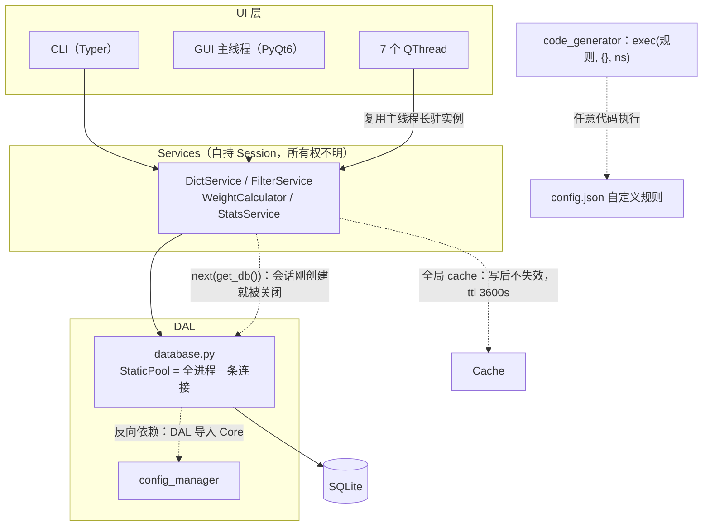
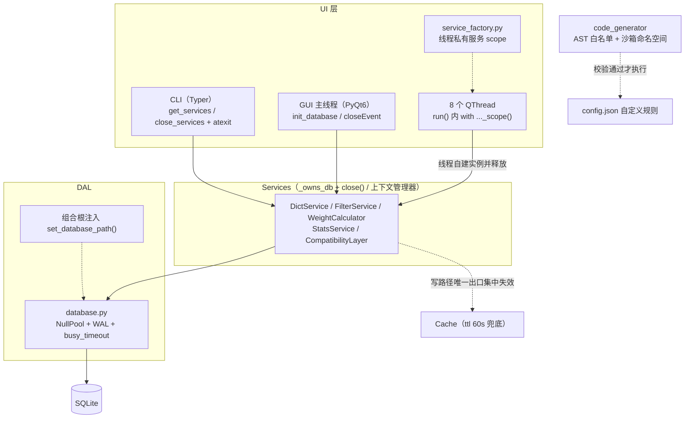
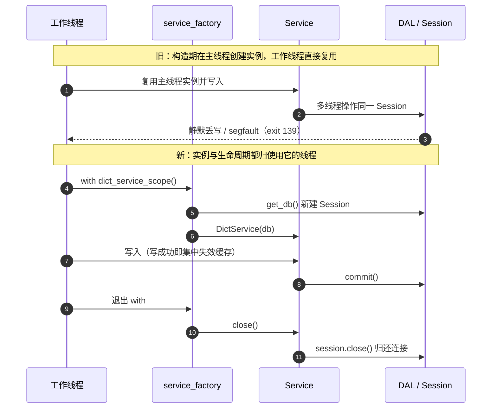

# VMtool 新旧架构对比

> 2026-09-19 · 对比对象：架构评审基线（commit `552f4ea`）→ 修复后（commit `1c9ddc6`）
> 配套：`ARCHITECTURE_REVIEW.md`（评审与方案）、`EXECUTION_REPORT.md`（执行结果与复盘）

---

## 一、一句话结论

**这不是一次重写，是一次「接缝修复」。** 分层骨架（DAL → Services → UI）、包划分、单表多态数据模型、双配置系统、编码规则语法、GUI 标签页结构——全部保留。改动集中在六条**跨层接缝**上：会话所有权、连接与并发、缓存一致性、规则执行沙箱、依赖完整性、质量门禁。

---

## 二、旧架构

**六条接缝各自的问题：**

| 接缝 | 旧行为 | 后果 |
|---|---|---|
| 会话获取 | `get_db()` 是生成器，16 处写 `self.db = next(get_db())` | CPython 下生成器立即被回收，`finally: db.close()` 先于下一条语句执行——**会话刚建就被关闭**，服务仍在对已关闭的会话操作（SQLAlchemy 隐式重开事务），事务边界由引用计数决定 |
| 会话所有权 | 无明确归属 | 谁创建、谁关闭、何时关闭都没有约定；close() 靠 GC |
| 连接与并发 | `StaticPool` + `check_same_thread=False` | 全进程共用**一条** DBAPI 连接；且 7 个 GUI 工作线程**复用主线程创建的长驻 Session** → 静默丢写，实测可致**进程级 segfault（exit 139）** |
| 缓存一致性 | 全局 `Cache(ttl=3600)`，只有 2 个读方法挂缓存，写路径**从不清除** | 改词/改权重后最长 1 小时读到旧值（静默数据错误） |
| 规则执行 | `exec(内容, {}, 局部变量)` | globals 传 `{}` 会被自动注入 `__builtins__` → 规则内容来自可导入导出的 `config.json`，**导入他人配置即任意代码执行** |
| 依赖与门禁 | psutil 用了没声明；fastapi/uvicorn/jinja2/alembic 声明了没用；PyQt6 未约束 Qt 运行时 | 干净安装核心链路直接 ImportError；PyQt6 abi3 扩展与 Qt 版本错配导致 GUI 完全不可导入；无 CI，ruff 1718 错 / mypy 109 错 / 3 个测试用例全部失败 |

---

## 三、新架构

**同一批接缝的新约定：**

| 接缝 | 新行为 | 收益 |
|---|---|---|
| 会话获取 | `get_db()` 改为**显式会话工厂**（返回新 Session，支持 `with`） | 事务边界由代码决定，不再由引用计数决定 |
| 会话所有权 | 服务带 `_owns_db`；`close()` + `__enter__/__exit__`；**自建的关、注入的不关**；CLI 用 `close_services()`+atexit，GUI 用 `closeEvent()` | 「谁创建、谁关闭」有唯一答案，异常路径也释放 |
| 连接与并发 | `NullPool`（每会话各自 checkout）+ 连接事件注入 `PRAGMA journal_mode=WAL`、`busy_timeout=30000` | 从根上移除共享连接；读写不再互相阻塞 |
| GUI 线程模型 | 8 个线程类在 `run()` 内 `with ..._scope()` 自建自释放；构造签名**不再接收服务实例**；工厂注册的是普通可调用对象（并校验其不触碰 Session） | 跨线程共享 Session 消失；并发写落库数精确等于期望数 |
| 服务层同构 | `FilterService._import_file_in_own_session()` 在服务层内实现同款隔离（不反向依赖 UI） | 批量导入不再丢数据（实测 240/240） |
| 缓存一致性 | 写路径唯一出口 `_notify_data_changed()` → `cache.clear()`；`WeightCalculator._invalidate_cache()`；ttl 降到 60s 兜底 | 写后立即可读；ttl 只作兜底 |
| 规则沙箱 | AST 结构白名单（节点类型 / 内建 / 方法）+ **属性读取也过白名单** + 绑定名来源追溯 + 禁止属性赋值；`exec` 时 `__builtins__={}` | 无已知绕过；校验失败抛明确异常，不再静默降级 |
| 依赖完整性 | 声明集合 == 实际 import 集合（**无豁免名单**，传递依赖不算）；PyQt6/Qt6 钉 `<6.7`；`REQUIRED_DEPS` 由元数据派生 | 干净安装可用；同类缺陷有可执行门禁 |
| 质量门禁 | CI（ruff / pytest **硬失败**，mypy 暂软）+ pre-commit；两条纯 Python 门禁测试（依赖一致性、GUI 线程约定 AST + 信号声明） | 坏提交实测被拦；回归有网 |
| 测试 | 3 个用例全红 → **107 passed**；`conftest.py` 全局隔离真实库（不重定向 DAL 直接连库即抛错）；关键用例经**变异验证** | 从「测试从未通过」到「测试能拦人」 |
| 死代码 | `ui/gui/threads.py`（被同名包遮蔽）、`code_rules_settings.py`、`service_registry.py`、`main.py` 已删 | −629 行；仓库根冗余产物同清 |
| 迁移 | 自研 `app/dal/migration.py`，且不再依赖 `app.core` | 声明与实现一致；DAL→Core 反向依赖清零 |

---

## 四、关键机制对比：一次「写入 + 读取」的归属变化

---

## 五、没有变的部分（有意保留）

- **分层骨架与包划分**：DAL → Services → UI 三层结构、目录组织
- **单表多态数据模型**：`words` 表用 `is_character` / `is_special` / `manual` 区分词条类型
- **双配置系统**：`config.py`（Pydantic 静态）+ `config_manager.py`（JSON 运行时）
- **编码规则语法与产品能力**：模板语法 + Python 模式（只加固执行环境，不改语法）
- **GUI 信息架构**：标签页 / 设置面板结构、主题体系
- **仓库层抽象**：`repositories.py` 保持不变（后期需把原生 SQL 下沉进来）

## 六、仍未做（不是遗漏，是明确的范围外）

- **`DictService` 仍然 832 行**：CRUD / 编码 / 批量 / 去重 / 导出混在一个类里（阶段 2）
- **`delete_table` / `auto_dedupe` 仍写原生 SQL**，绕过仓库层（阶段 2）
- **`code_rules` 两套 UI 实现**（`code_rules_tab.py` 与 `settings/code_rules_panel.py`）未合并（阶段 2）
- **插件系统仍未接线**（`app/plugins/` 存在但启动流程不加载）
- **覆盖率仅 19%**、**mypy 119 错且 CI 中非阻断**（阶段 3）
- **沙箱无执行超时**（可被 `range(10**12)` 长时间占用，属资源面而非绕过）
- **特殊字符批量添加自 HEAD 起必抛 TypeError**（用户可点功能长期坏，建议单独立项）
