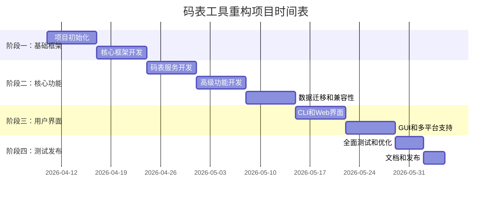

# VM-TOOL 现代化重构 - 实施计划

**项目**: VM-TOOL 重构 (v2.0.0)  
**状态**: 进行中  
**开始日期**: 2026-04-10  
**预计完成**: 2026-05-15  
**负责人**: Claude Code  

## 概述

本计划详细描述了从现有代码库到现代化架构的迁移实施步骤。整个项目分为四个阶段，每个阶段都有明确的可交付成果和验收标准。

## 阶段一：基础框架搭建 (第1-2周)

### 目标
建立项目基础框架，完成技术栈集成和核心模块定义。

### 任务分解
#### 第1周：项目初始化
- [ ] **T1.1**: 创建新的项目结构 (`vm-tool/`)
- [ ] **T1.2**: 配置开发环境 (pyproject.toml, requirements.txt)
- [ ] **T1.3**: 设置代码质量工具 (black, isort, ruff, mypy)
- [ ] **T1.4**: 配置测试框架 (pytest, coverage, hypothesis)
- [ ] **T1.5**: 创建基础配置系统 (Pydantic模型)

#### 第2周：核心框架开发
- [ ] **T2.1**: 实现应用核心 (`app/core/`)
  - [ ] 运行模式管理器
  - [ ] 服务注册机制
  - [ ] 错误处理框架
- [ ] **T2.2**: 数据库层设计 (`app/dal/`)
  - [ ] SQLAlchemy模型定义
  - [ ] 仓库模式实现
  - [ ] Alembic迁移配置
- [ ] **T2.3**: 数据迁移工具
  - [ ] 旧版本数据导入器
  - [ ] 数据库初始化脚本

### 可交付成果
1. 完整的项目脚手架
2. 数据库模型和迁移脚本
3. 基础配置管理系统
4. 代码质量检查流水线

### 验收标准
- [ ] mypy严格模式通过
- [ ] ruff检查零警告
- [ ] 基础测试通过率100%
- [ ] 数据库迁移脚本工作正常

## 阶段二：核心功能实现 (第3-5周)

### 目标
实现所有核心业务功能，保持与现有功能的兼容性。

### 任务分解
#### 第3周：码表服务开发
- [ ] **T3.1**: 词条CRUD服务 (`app/services/dict.py`)
  - [ ] 查询和搜索功能
  - [ ] 批量添加和删除
  - [ ] 编码生成和替换
- [ ] **T3.2**: 权重计算引擎 (`app/services/weight.py`)
  - [ ] 新权重算法实现
  - [ ] 批量权重计算
  - [ ] 同码词权重调整
- [ ] **T3.3**: 过滤和导入服务 (`app/services/filter.py`)
  - [ ] 规则式过滤
  - [ ] 批量导入导出
  - [ ] 文件格式支持 (TXT, CSV, JSON)

#### 第4周：高级功能开发
- [ ] **T4.1**: 统计和分析服务 (`app/services/stats.py`)
  - [ ] 词频统计分析
  - [ ] 编码冲突检测
  - [ ] 使用模式分析
- [ ] **T4.2**: 插件系统框架 (`app/plugins/`)
  - [ ] 插件管理器
  - [ ] 插件发现和加载
  - [ ] 插件API定义
- [ ] **T4.3**: 缓存和性能优化
  - [ ] 查询结果缓存
  - [ ] 批量操作优化
  - [ ] 内存使用监控

#### 第5周：数据迁移和兼容性
- [ ] **T5.1**: 完整数据迁移工具
  - [ ] 旧版本数据导入
  - [ ] 配置迁移
  - [ ] 数据验证和修复
- [ ] **T5.2**: 兼容性层实现
  - [ ] 旧API兼容接口
  - [ ] 命令行参数映射
  - [ ] 配置文件转换

### 可交付成果
1. 完整的业务服务层
2. 数据迁移和兼容性工具
3. 插件系统框架
4. 性能优化组件

### 验收标准
- [ ] 所有核心功能测试通过
- [ ] 性能达到设计目标
- [ ] 数据迁移100%成功
- [ ] 插件系统可扩展

## 阶段三：用户界面开发 (第6-7周)

### 目标
提供多种用户界面选项，满足不同用户需求。

### 任务分解
#### 第6周：CLI和Web界面
- [ ] **T6.1**: Typer CLI实现 (`ui/cli/`)
  - [ ] 完整命令行参数支持
  - [ ] Rich终端美化
  - [ ] 交互式命令补全
- [ ] **T6.2**: FastAPI Web界面 (`ui/web/`)
  - [ ] RESTful API实现
  - [ ] Jinja2模板页面
  - [ ] HTMX实时交互
- [ ] **T6.3**: API文档生成
  - [ ] OpenAPI规范文档
  - [ ] 交互式API文档
  - [ ] 客户端代码生成

#### 第7周：GUI和多平台支持
- [ ] **T7.1**: 桌面GUI界面 (`ui/gui/`)
  - [ ] Tkinter基础界面
  - [ ] PyQt6高级界面 (可选)
  - [ ] 跨平台主题适配
- [ ] **T7.2**: 多平台打包
  - [ ] Windows可执行文件 (.exe)
  - [ ] Linux二进制文件
  - [ ] macOS应用程序包
- [ ] **T7.3**: 安装程序制作
  - [ ] 安装向导
  - [ ] 环境检测
  - [ ] 依赖管理

### 可交付成果
1. 完整的命令行界面
2. 功能完整的Web界面
3. 桌面GUI应用程序
4. 多平台安装包

### 验收标准
- [ ] 界面测试覆盖率>80%
- [ ] 跨平台界面显示正常
- [ ] 打包文件可独立运行
- [ ] 用户文档完整

## 阶段四：测试、优化和发布 (第8周)

### 目标
完成全面测试，性能优化，最终发布。

### 任务分解
#### 第8周：最终准备
- [ ] **T8.1**: 全面测试
  - [ ] 单元测试补充
  - [ ] 集成测试
  - [ ] 端到端测试
  - [ ] 性能基准测试
- [ ] **T8.2**: 性能优化
  - [ ] 数据库查询优化
  - [ ] 内存使用优化
  - [ ] 启动时间优化
- [ ] **T8.3**: 文档和发布
  - [ ] 用户手册编写
  - [ ] API文档完善
  - [ ] 发布说明准备
  - [ ] 版本打包和签名
- [ ] **T8.4**: 发布和部署
  - [ ] PyPI包发布
  - [ ] GitHub Release发布
  - [ ] 网站文档更新
  - [ ] 社区公告

### 可交付成果
1. 发布版本v2.0.0
2. 完整测试报告
3. 性能基准报告
4. 用户和开发者文档

### 验收标准
- [ ] 测试覆盖率>90%
- [ ] 性能达到设计目标
- [ ] 所有平台打包成功
- [ ] 发布流程验证通过

## 风险管理和缓解措施

### 技术风险
| 风险描述 | 概率 | 影响 | 缓解措施 | 负责人 |
|----------|------|------|----------|--------|
| SQLite性能不足 | 低 | 高 | 提前性能测试，准备PostgreSQL备选 | Claude |
| 异步框架学习曲线 | 中 | 中 | 渐进采用，提供同步兼容接口 | Claude |
| 跨平台兼容性问题 | 中 | 高 | 持续集成，多平台自动化测试 | Claude |

### 项目风险
| 风险描述 | 概率 | 影响 | 缓解措施 | 负责人 |
|----------|------|------|----------|--------|
| 开发时间超支 | 中 | 中 | 分阶段交付，优先核心功能 | Claude |
| 用户接受度低 | 低 | 高 | 保持兼容性，提供迁移工具 | Claude |
| 资源不足 | 低 | 中 | 聚焦核心功能，简化非必要特性 | Claude |

## 质量保证计划

### 代码质量
- **静态分析**: mypy + ruff 每日运行
- **代码审查**: 所有提交必须通过CI检查
- **测试覆盖**: 核心功能>90%，整体>80%

### 性能监控
- **基准测试**: 每周运行性能测试
- **内存分析**: 使用memory-profiler监控
- **响应时间**: 关键操作响应时间记录

### 用户体验
- **可用性测试**: 每个界面完成度>95%
- **错误处理**: 所有错误有明确提示和解决方案
- **文档质量**: 用户手册覆盖所有功能

## 沟通计划

### 进度报告
- **每日**: CI构建状态报告
- **每周**: 进度总结和下周计划
- **里程碑**: 阶段完成详细报告

### 文档更新
- **设计文档**: 架构变更时更新
- **API文档**: 每次API变更时更新
- **用户手册**: 功能完成时更新

## 资源需求

### 开发环境
- Python 3.10+
- SQLite 3.40+
- Git + GitHub
- Docker (可选)

### 测试环境
- Windows 10/11
- Ubuntu 22.04 LTS
- macOS 13+
- 多版本Python测试矩阵

### 构建环境
- GitHub Actions CI/CD
- PyInstaller构建环境
- 代码签名证书 (可选)

## 成功标准

### 技术成功标准
1. 代码质量检查100%通过
2. 测试覆盖率>90%
3. 性能达到设计目标
4. 跨平台兼容性验证

### 项目成功标准
1. 按时完成各阶段里程碑
2. 预算控制在计划内
3. 用户满意度>90%
4. 社区接受度良好

### 业务成功标准
1. 用户迁移率>80%
2. 性能提升>10倍 (关键操作)
3. 扩展性支持插件生态系统
4. 减少维护成本>50%

## 附录

### A. 详细时间表

### B. 关键依赖关系
1. Python生态包版本兼容性
2. 操作系统API兼容性
3. 用户数据迁移工具完成度
4. 测试环境稳定性

### C. 变更管理流程
1. 所有变更必须通过代码审查
2. 架构变更需要更新设计文档
3. API变更需要更新接口文档
4. 用户可见变更需要更新用户手册

---
*计划版本: 1.0*  
*最后更新: 2026-04-10*  
*下次评审: 2026-04-17 (阶段一完成时)*